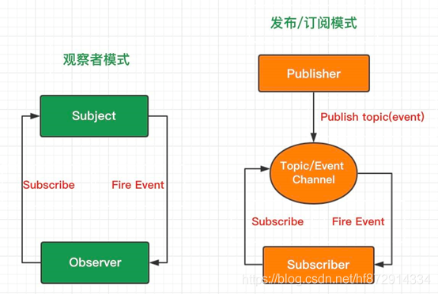
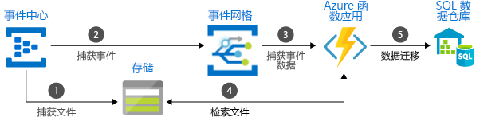
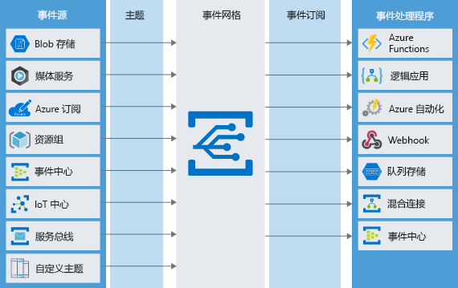

Azure messaging services

## 设计模式

[发布订阅模式与观察者模式 - SegmentFault 思否](https://segmentfault.com/a/1190000038881989#:~:text=发布订阅模式（Pub-Sub Pattern）&text=在现在的发布订阅,分发它们给订阅者。)

### 观察者模式和发布订阅模式有什么区别？

我们先来看下这两个模式的实现结构：


**观察者模式：** 观察者（Observer）直接订阅（Subscribe）主题（Subject），而当主题被激活的时候，会触发（Fire Event）观察者里的事件。

**发布订阅模式：** 订阅者（Subscriber）把自己想订阅的事件注册（Subscribe）到调度中心（Topic），当发布者（Publisher）发布该事件（Publish topic）到调度中心，也就是该事件触发时，由调度中心统一调度（Fire Event）订阅者注册到调度中心的处理代码。


Eg：


```js
  //有一家猎人工会，其中每个猎人都具有发布任务(publish)，订阅任务(subscribe)的功能
    //他们都有一个订阅列表来记录谁订阅了自己
    //定义一个猎人类
    //包括姓名，级别，订阅列表
    function Hunter(name, level){
        this.name = name
        this.level = level
        this.list = []
    }
    Hunter.prototype.publish = function (money){
        console.log(this.level + '猎人' + this.name + '寻求帮助')
        this.list.forEach(function(item, index){
            item(money)
        })
    }
    Hunter.prototype.subscribe = function (targrt, fn){
        console.log(this.level + '猎人' + this.name + '订阅了' + targrt.name)
        targrt.list.push(fn)
    }
    
    //猎人工会走来了几个猎人
    let hunterMing = new Hunter('小明', '黄金')
    let hunterJin = new Hunter('小金', '白银')
    let hunterZhang = new Hunter('小张', '黄金')
    let hunterPeter = new Hunter('Peter', '青铜')
    
    //Peter等级较低，可能需要帮助，所以小明，小金，小张都订阅了Peter
    hunterMing.subscribe(hunterPeter, function(money){
        console.log('小明表示：' + (money > 200 ? '' : '暂时很忙，不能') + '给予帮助')
    })
    hunterJin.subscribe(hunterPeter, function(){
        console.log('小金表示：给予帮助')
    })
    hunterZhang.subscribe(hunterPeter, function(){
        console.log('小金表示：给予帮助')
    })
    
    //Peter遇到困难，赏金198寻求帮助
    hunterPeter.publish(198)
    
    //猎人们(观察者)关联他们感兴趣的猎人(目标对象)，如Peter，当Peter有困难时，会自动通知给他们（观察者）` 

**发布订阅模式：**
  //定义一家猎人工会
    //主要功能包括任务发布大厅(topics)，以及订阅任务(subscribe)，发布任务(publish)
    let HunterUnion = {
        type: 'hunt',
        topics: Object.create(null),
        subscribe: function (topic, fn){
            if(!this.topics[topic]){
                  this.topics[topic] = [];  
            }
            this.topics[topic].push(fn);
        },
        publish: function (topic, money){
            if(!this.topics[topic])
                  return;
            for(let fn of this.topics[topic]){
                fn(money)
            }
        }
    }
    
    //定义一个猎人类
    //包括姓名，级别
    function Hunter(name, level){
        this.name = name
        this.level = level
    }
    //猎人可在猎人工会发布订阅任务
    Hunter.prototype.subscribe = function (topic, fn){
        console.log(this.level + '猎人' + this.name + '订阅了狩猎' + topic + '的任务')
        HunterUnion.subscribe(topic, fn)
    }
    Hunter.prototype.publish = function (topic, money){
        console.log(this.level + '猎人' + this.name + '发布了狩猎' + topic + '的任务')
        HunterUnion.publish(topic, money)
    }
    
    //猎人工会走来了几个猎人
    let hunterMing = new Hunter('小明', '黄金')
    let hunterJin = new Hunter('小金', '白银')
    let hunterZhang = new Hunter('小张', '黄金')
    let hunterPeter = new Hunter('Peter', '青铜')
    
    //小明，小金，小张分别订阅了狩猎tiger的任务
    hunterMing.subscribe('tiger', function(money){
        console.log('小明表示：' + (money > 200 ? '' : '不') + '接取任务')
    })
    hunterJin.subscribe('tiger', function(money){
        console.log('小金表示：接取任务')
    })
    hunterZhang.subscribe('tiger', function(money){
        console.log('小张表示：接取任务')
    })
    //Peter订阅了狩猎sheep的任务
    hunterPeter.subscribe('sheep', function(money){
        console.log('Peter表示：接取任务')
    })
    
    //Peter发布了狩猎tiger的任务
    hunterPeter.publish('tiger', 198)
    
    //猎人们发布(发布者)或订阅(观察者/订阅者)任务都是通过猎人工会(调度中心)关联起来的，他们没有直接的交流。` 

观察者模式和发布订阅模式最大的区别就是发布订阅模式有个事件调度中心。

观察者模式由具体目标调度，每个被订阅的目标里面都需要有对观察者的处理，这种处理方式比较直接粗暴，但是会造成代码的冗余。

而发布订阅模式中统一由调度中心进行处理，订阅者和发布者互不干扰，消除了发布者和订阅者之间的依赖。这样一方面实现了解耦，还有就是可以实现更细粒度的一些控制。比如发布者发布了很多消息，但是不想所有的订阅者都接收到，就可以在调度中心做一些处理，类似于权限控制之类的。还可以做一些节流操作。

观察者模式是不是发布订阅模式
--------------

网上关于这个问题的回答，出现了两极分化，有认为发布订阅模式就是观察者模式的，也有认为观察者模式和发布订阅模式是真不一样的。

其实我不知道发布订阅模式是不是观察者模式，就像我不知道辨别模式的关键是设计意图还是设计结构（理念），虽然《JavaScript设计模式与开发实践》一书中说了`分辨模式的关键是意图而不是结构`。

如果以结构来分辨模式，发布订阅模式相比观察者模式多了一个中间件订阅器，所以发布订阅模式是不同于观察者模式的；如果以意图来分辨模式，他们都是`实现了对象间的一种一对多的依赖关系，当一个对象的状态发生改变时，所有依赖于它的对象都将得到通知，并自动更新`，那么他们就是同一种模式，发布订阅模式是在观察者模式的基础上做的优化升级。

```

[观察者模式 vs 发布订阅模式 - 知乎 (zhihu.com)](https://zhuanlan.zhihu.com/p/51357583)

Azure Doc：

发布与订阅模式：

[发布者-订阅者模式 - Azure Architecture Center | Microsoft Docs](https://docs.microsoft.com/zh-cn/azure/architecture/patterns/publisher-subscriber)


## Basic

### Learn Path

[选择是否使用消息或事件 - Learn | Microsoft Docs](https://docs.microsoft.com/zh-cn/learn/modules/choose-a-messaging-model-in-azure-to-connect-your-services/2-choose-whether-to-use-message-queues-or-events)

==TODO== Review

### Architecture



[Azure 消息 & 事件服务的选择 – 上篇 | Azure Docs](https://docs.azure.cn/zh-cn/articles/azure-operations-guide/internet-of-things/aog-internet-of-things-howto-select-message-event-service-part-1)


### 事件与消息

需要注意传递事件的服务和传递消息的服务之间的重要区别。

**事件 Event** 
事件是条件或状态更改的轻量级通知。事件的发布者对事件的处理方式没有期望。事件的消费者决定如何处理通知。事件可以是离散单元或系列的一部分。

（An event is a lightweight notification of a condition or a state change. The publisher of the event has no expectation about how the event is handled. The consumer of the event decides what to do with the notification. Events can be discrete units or part of a series.）

离散事件报告状态变化并且是可操作的。要进行下一步，消费者只需要知道发生了一些事情。事件数据有关于发生了什么的信息，但没有触发事件的数据。例如，事件通知消费者文件已创建。它可能有关于文件的一般信息，但它没有文件本身。离散事件非常适合需要扩展的无服务器解决方案。

（Discrete events report state change and are actionable. To take the next step, the consumer only needs to know that something happened. The event data has information about what happened but doesn't have the data that triggered the event. For example, an event notifies consumers that a file was created. It may have general information about the file, but it doesn't have the file itself. Discrete events are ideal for serverless solutions that need to scale.）

系列事件报告一个条件并且是可分析的。事件按时间顺序排列且相互关联。消费者需要按顺序排列的一系列事件来分析发生了什么。

（A series of events report a condition and are analyzable. The events are time-ordered and interrelated. The consumer needs the sequenced series of events to analyze what happened.）

事件用来描述程序的运行状态或环境的改变。例如鼠标移动、用户按键、窗口状态的改变、时钟计时、线程结束等等等等。 

事件具有以下特征：

- 事件是一个轻量通知，表明发生了某些事情。
- 可以将事件发送到多个接收方或根本不发送到任何接收方。
- 事件通常旨在为每个发布者“扇出”或提供大量订阅者。
- 事件发布者对接收组件所采取的操作没有任何期望。
- 某些事件是离散单元，与其他事件无关。
- 某些事件是相关和有序系列的一部分。

**消息 Message**
消息是服务产生的原始数据，用于消费或存储在其他地方。消息包含触发消息管道的数据。消息的发布者对消费者如何处理消息有预期。双方之间存在合同。例如，发布者发送带有原始数据的消息，并期望消费者根据该数据创建一个文件，并在工作完成后发送响应。

（A message is raw data produced by a service to be consumed or stored elsewhere. The message contains the data that triggered the message pipeline. The publisher of the message has an expectation about how the consumer handles the message. A contract exists between the two sides. For example, the publisher sends a message with the raw data, and expects the consumer to create a file from that data and send a response when the work is done.）

消息实际上是一种通信的机制。操作系统往往会利用消息来通知应用程序某个事件的发生，但这并不意味着消息与事件就是一一对应的或者说是相当的。  
  例如，应用程序完全可以自己直接来监视某个事件的发生并对其做出响应，而不依赖于消息；反之，应用程序也可以在没有事件发生的情况下发送消息，完成通信的功能，或者模拟一次事件。

在分布式应用程序的术语中，消息具有以下特征：

- 消息包含由一个组件生成的原始数据，该数据将由另一个组件使用。
- 消息本身就包含该数据，而不仅仅是对该数据的引用。
- 发送组件期望目标组件以特定方式处理消息内容。 整个系统的完整性可能取决于执行特定作业的发送方和接收方。

**更多区别描述**

事件是一个动作——用户触发的动作。   

消息是一个信息——传递给系统的信息。    

事件与消息的概念在计算机中较易混淆，但本质不同：  

事件由用户（操作电脑的人）触发且只能由用户触发，操作系统能够感觉到由用户触发的事件，并将此事件转换为一个（特定的）消息发送到程序的消息队列中。  

  这里强调的是：   

  可以说“用户触发了一个事件”，而不能说“用户触发了一个消息”。   

  用户只能触发事件，而事件只能由用户触发。   

  一个事件产生后，将被操作系统转换为一个消息，所以一个消息可能是由一个事件转换而来（或者由操作系统产生）。   

  一个消息可能会产生另一个消息，但一个消息决不能产生一个事件——时间只能由用户触发。     总结（事件：消息的来源）  

  事件：只能由用户通过外设的输入产生。 
  消息：（产生消息的来源有三个）   

  （1）   由操作系统产生。   

  （2）   由用户触发的事件转换而来。   

  （3）   由另一个消息产生。

**如何选择消息或事件**
单个应用程序可能会将事件用于某些目的，而将消息用于其他目的。 在选择之前，必须分析应用程序的系结构及其所有用例，以便确定其组件相互通信的所有不同目的。

事件更有可能用于广播，并且通常是短暂的，这意味着如果没有订阅者，通信可能不由任何接收方处理。 如果分布式应用程序要求保证通信得到处理，则更有可能使用消息。

对于每个通信，请考虑以下问题：发送组件是否期望目标组件以特定方式处理通信？

如果答案是肯定的，请选择使用消息。 如果答案是否定的，可以使用事件。

了解组件通信所需的方式将有助于选择组件的通信方式。 首先来使用消息。


### Comparison of services

| Service     | Purpose                         | Type                          | When to use                                 |
| :---------- | :------------------------------ | :---------------------------- | :------------------------------------------ |
| Event Grid  | Reactive programming            | Event distribution (discrete) | React to status changes                     |
| Event Hubs  | Big data pipeline               | Event streaming (series)      | Telemetry and distributed data streaming    |
| Service Bus | High-value enterprise messaging | Message                       | Order processing and financial transactions |


| 服务     | 用途               | 类型                 | 何时使用                     |
| :------- | :----------------- | :------------------- | :--------------------------- |
| 事件网格 | 反应编程           | 事件分发（离散）     | 对状态更改做出响应           |
| 事件中心 | 大数据管道         | 事件流式处理（系列） | 遥测数据和分布式数据流式处理 |
| 服务总线 | 高价值企业消息传递 | Message              | 订单处理和财务交易           |

More：[Events, Data Points, and Messages - Choosing the right Azure messaging service for your data | Azure Blog and Updates | Microsoft Azure](https://azure.microsoft.com/en-us/blog/events-data-points-and-messages-choosing-the-right-azure-messaging-service-for-your-data/)

- **Azure 事件网格**——事件驱动的发布订阅模型（想想反应式编程）
- **Azure 事件中心**——多源大数据流管道（想想遥测数据）
- **Azure 服务总线**——传统的企业代理消息系统（取代 Azure 队列存储）


**事件网格和事件中心之间的区别**

1. 事件网格不保证事件的顺序，但事件中心使用有序序列的分区，因此它可以维护同一分区中事件的顺序。
2. 事件中心仅接受用于摄取数据的端点，并且不提供将数据发送回发布者的机制。另一方面，事件网格发送 HTTP 请求来通知发布者中发生的事件。
3. 事件网格可以触发 Azure 函数。对于事件中心，Azure 函数需要拉取和处理事件。
4. 事件网格是一种分发系统，而不是一种排队机制。如果一个事件被推入，它会立即被推出，如果它没有得到处理，它就永远消失了。除非我们将未传递的事件发送到存储帐户。这个过程被称为死信。
5. 在事件中心，数据最多可以保留 7 天，然后重播。这使我们能够从某个点恢复或从较旧的时间点重新启动并在需要时重新处理事件。

**事件中心和服务总线之间的区别**

对于外部发布者或接收者来说，服务总线和事件中心看起来非常相似，这就是很难理解两者之间的区别以及何时使用什么的原因。

1. 事件中心专注于事件流，其中服务总线更像是一个传统的消息传递代理。
2. 服务总线用作将在云中运行的应用程序连接到其他应用程序或服务并在它们之间传输数据的主干，而事件中心则更关心接收具有高吞吐量和低延迟的海量数据。
3. 事件中心将多个事件生成器与事件接收器分离，而服务总线旨在分离应用程序。
4. 服务总线消息传递支持消息属性“生存时间”，而事件中心的默认保留期为 7 天。
5. 服务总线具有消息会话的概念。它允许根据会话 ID 属性关联消息，而事件中心则不允许。
6. 服务总线消息被接收器拉出并且无法再次处理，而事件中心消息可以被多个接收器摄取。
7. 服务总线使用队列和主题的术语，而使用事件中心分区术语。


More notes：[Azure AZ-204 备考笔记13-在 Azure 中选择一个消息模型以松散的方式连接服务 - 知乎 (zhihu.com)](https://zhuanlan.zhihu.com/p/365690885)


## [Azure Service Bus](https://www.cnblogs.com/AllenMaster/p/14000933.html)

概念：[Azure 服务总线消息传送队列、主题和订阅 - Azure Service Bus | Microsoft Docs](https://docs.microsoft.com/zh-cn/azure/service-bus-messaging/service-bus-queues-topics-subscriptions)


[Azure Service Bus（一）入门简介 - Grant_Allen - 博客园 (cnblogs.com)](https://www.cnblogs.com/AllenMaster/p/14000933.html)

Azure Service Bus：是微软在Azure 上提供的一种 ”云消息服务“，在应用和服务之间传递消息时，即使消息的接受着处于脱机状态下，也不影响接收者在联机后接收信息。保证了消息数据的可靠性和持久性，同时数据通过消息在不同的应用程序和服务之间传输。 消息采用二进制格式，可能包含 JSON、XML 或纯文本。但是缺点就是成本和消息大小。Azure Service Bus 队列消息必须大于 64KB，同时还必须小于 256KB


### 存储队列和服务总线队列

以下各部分中的表提供队列功能的逻辑分组。 通过下面的表，可以清楚地比较 Azure 存储队列和服务总线队列中的可用功能。

存储队列是 [Azure 存储](https://azure.microsoft.com/services/storage/)基础结构的一部分。 存储队列允许存储大量消息。 可以使用 HTTP 或 HTTPS 通过经验证的调用从世界任何位置访问消息。 队列消息大小最大可为 64 KB。 一个队列可以包含数百万条消息，直至达到存储帐户的总容量限值。 队列通常用于创建要异步处理的积压工作 (backlog)。 有关详细信息，请参阅[什么是 Azure 存储队列](https://docs.microsoft.com/zh-cn/azure/storage/queues/storage-queues-introduction)。

服务总线队列是更广泛的 [Azure 消息传递](https://azure.microsoft.com/services/service-bus/)基础结构的一部分，可支持队列、发布/订阅和更高级的集成模式。 服务总线队列旨在集成可能跨多个通信协议、数据约定、信任域或网络环境的应用程序或应用程序组件。 有关服务总线队列/话题/订阅的详细信息，请参阅[服务总线队列、主题和订阅](https://docs.microsoft.com/zh-cn/azure/service-bus-messaging/service-bus-queues-topics-subscriptions)。

这时候有人就说了，那 Azure Storage Queue 和Azure Service Bus 有啥区别？

　　Azure Storage Queue：允许我们存储大量的消息可以被使用者读取，并且队列消息非常灵活，如果初始使用者出现故障，则可以由不同的消费进程再次处理。队列可以在消费者之间保存状态。

　　Azure Service Bus：服务总线队列提供了一个代理消息通信模型。分布式应用程序可以在一个FIFO 模式中共享消息，同时单个消息只能由一个消息使用者接收。

| **Storage Queues**      | **Service Bus Queues** |
| ----------------------- | ---------------------- |
| 任意排序                | 使用FIFO保证排序       |
| 交付至少一次, 可能多次  | 至少交付一次，最多一次 |
| 30秒默认锁可以延长到7天 | 60秒的默认锁可以续订   |
| 支持就地更新消息内容    | 消息在一次消费后被删除 |
| 可以与 WF 集成          | 与 WCF和WF本地集成     |

**比较存储队列和服务总线队列**

以下各部分中的表提供队列功能的逻辑分组。 通过下面的表，可以清楚地比较 Azure 存储队列和服务总线队列中的可用功能。

**基础功能**

本部分比较存储队列和服务总线队列提供的一些基础队列功能。

| 比较条件          | 存储队列                                                     | 服务总线队列                                                 |
| :---------------- | :----------------------------------------------------------- | :----------------------------------------------------------- |
| 排序保障          | 否  有关详细信息，请参阅[其他信息](https://docs.microsoft.com/zh-cn/azure/service-bus-messaging/service-bus-azure-and-service-bus-queues-compared-contrasted#additional-information)部分的第一条说明。 | 是 - 先入先出 (FIFO)  （通过使用[消息会话](https://docs.microsoft.com/zh-cn/azure/service-bus-messaging/message-sessions)） |
| 传递保障          | 至少一次                                                     | 至少一次（使用 PeekLock 接收模式，这是默认值）  最多一次（使用 ReceiveAndDelete 接收模式）  详细了解各种[接收模式](https://docs.microsoft.com/zh-cn/azure/service-bus-messaging/service-bus-queues-topics-subscriptions#receive-modes) |
| 原子操作支持      | 否                                                           | 是                                                           |
| 接收行为          | 非阻塞  （如果没有发现新消息，则立即完成）                   | 阻止超时或未超时  （提供长轮询，或[“Comet 技术”](https://go.microsoft.com/fwlink/?LinkId=613759)）  非阻塞  （仅使用 .NET 托管 API） |
| 推送样式 API      | 否                                                           | 是  .NET、Java、JavaScript 和 Go SDK 提供推送式 API。        |
| 接收模式          | &                                                            | 速览与锁定  &                                                |
| 独占访问模式      | 基于租赁                                                     | 基于锁定                                                     |
| 租赁/锁定持续时间 | 30 秒（默认值）  7 天（最大值） （可使用 [UpdateMessage](https://docs.microsoft.com/zh-cn/dotnet/api/microsoft.azure.storage.queue.cloudqueue.updatemessage) API 续订或释放消息租赁。） | 30 秒（默认值）  可以每次手动续订同一锁定持续时间的消息锁，或使用客户端管理锁定续订的自动锁定功能。 |
| 租赁/锁定精度     | 消息级别  每条消息可具有不同的超时值，你可在处理消息时，根据需要使用 [UpdateMessage](https://docs.microsoft.com/zh-cn/dotnet/api/microsoft.azure.storage.queue.cloudqueue.updatemessage) API 来更新超时值。 | 队列级别  （每个队列都具有一个适用于其中所有消息的锁定精度，但可以如上一行所述续订该锁） |
| 成批接收          | 是  （在检索消息时显式指定消息计数，最多可达 32 条消息）     | 是  （隐式启用预提取属性或使用事务显式启用）                 |
| 成批发送          | 否                                                           | 是  （通过使用事务或客户端批处理）                           |

### 其他信息

- 存储队列中的消息通常先进先出，但有时可能会不按顺序进出。 例如，由于客户端应用程序在处理消息时崩溃而导致消息的可见性超时持续时间到期时。 当可见性超时到期时，消息会再次变成在队列上可见，让另一个工作进程能够取消它的排队。 此时，重新变成可见的消息可以放置在队列中以再次取消其排队。
- 服务总线队列中有保障的 FIFO 模式要求使用消息传送会话。 如果应用程序处理在“速览并锁定”模式下接收的消息时发生崩溃，则当下次队列接收方接受消息传递会话时，它将在失败消息的生存时间 (TTL) 期限过期后从失败的消息开始。
- 存储队列旨在支持标准加入队列方案，例如以下方案：
  - 解耦应用程序组件，提高可伸缩性和故障容错能力
  - 负载分级
  - 构建过程工作流。
- 可以避免在服务总线会话上下文中处理消息时出现的不一致，方法是：使用会话状态来存储应用程序的状态（与处理会话的消息序列的进程相关），以及使用与处理接收的消息和更新会话状态相关的事务。 这种一致性功能有时在其他供应商的产品中标记为“只需处理一次”。 任何事务失败显然都将导致消息重新传递，这就是该术语不够恰当的原因。
- 存储队列可在多个队列、表和 Blob 上提供统一和一致的编程模型 – 对于开发人员和运营团队都是如此。
- 服务总线队列为单个队列的上下文中的本地事务提供支持。
- 服务总线支持的“接收与删除”模式提供了减少消息传送操作计数（和相关成本）以换取降低安全传递保证的能力。
- 存储队列提供租赁且可延长消息租赁时间。 此功能允许工作进程对消息保持短的租赁时间。 因此，如果某个工作进程崩溃，则其他工作进程可以再次快速处理该消息。 此外，如果工作进程处理消息所需的时间比当前租赁时间长，则工作进程可以延长该消息的租赁时间。
- 存储队列提供了可见性超时，可针对消息入队或出队进行设置。 此外，可以在运行时使用不同租赁值更新消息，并且可以跨同一队列的消息更新不同值。 服务总线锁定超时在队列元数据中定义。 不过，你可以手动续订预定义锁定持续时间的消息锁，或使用客户端管理锁定续订的自动锁定功能。
- 服务总线队列中阻塞接收操作的最大超时值为 24 天。 但是，基于 REST 的最大超时值为 55 秒。
- 服务总线提供的客户端批处理允许队列客户端将多个消息纳入一个发送操作中进行批处理。 批处理仅适用于异步发送操作。
- 有些特性，例如存储队列的 200 TB 上限（虚拟化帐户时更多）和无限制队列，使得它成为 SaaS 提供商的理想平台。
- 存储队列提供灵活且性能良好的委托访问控制机制。


### Features

**消息传递保证**

队列系统通常会保证将队列中的每条消息传递到目标组件。 但是，这些保证可以采取不同的方法：

- “至少一次”传递：在这种方法中，保证将每个消息传递到至少一个从队列中检索消息的组件。 但请注意，在某些情况下，同一条消息可能会传递多次。 例如，如果有两个 Web 应用实例从队列中检索消息，通常，每条消息仅传递到其中一个实例。 但是，如果一个实例花费较长时间来处理消息，并且超时已到期，则消息也可能会被发送到另一个实例。 设计 Web 应用代码时应该考虑到这种可能性。
- “至多一次”传递：在这种方法中，不保证每个消息都能被传递，并且消息可能不会到达的可能性很小。 但是，与“至少一次”传递不同，消息不会传递两次。 这有时被称为“自动重复检测”。
- 先进先出 (FIFO)：在大多数消息传递系统中，消息通常按照添加时的顺序离开队列，但你应考虑这种传递是否得到了保证。 如果分布式应用程序要求以完全正确的顺序处理消息，则必须选择包含 FIFO 保证的队列系统。

**事务支持**

当组中的一条消息传递失败时，一些紧密相关的消息组可能会引发问题。

例如，以电子商务应用程序为考虑对象。 当用户单击“购买”按钮时，可能会生成一系列消息并被发送到各个处理目标：

- 包含订单详细信息的消息将被发送到配送中心
- 包含总金额和付款详细信息的消息将被发送到信用卡处理器。
- 包含收据信息的消息将被发送到数据库，从而为客户生成发票

在此示例中，我们希望确保*所有的*消息都得到处理，或者不处理任何消息。 如果信用卡信息未送达并且所有的订单在没有付款的情况下就进行配送，那么我们将难以长久地在这个行业中发展！ 可以通过将两条消息分组到一个事务中来避免这类问题。 消息事务作为一个单元成功或失败 - 就像在数据库领域中一样。 如果信用卡详细信息消息传递失败，订单详细信息消息也将失败。


### **AMQP协议**

AMQP，即Advanced Message Queuing Protocol，**一个提供统一消息服务的应用层标准高级消息队列协议**，是应用层协议的一个开放标准，为面向消息的中间件设计。 基于此协议的客户端与消息中间件可传递消息，并不受客户端/中间件不同产品，不同的开发语言等条件的限制。

**Queue and topic**

[消息队列的两种模式_mob604756e605af的技术博客_51CTO博客](https://blog.51cto.com/u_15127503/4421315)


### Orders ==TODO==

**Can service bus guarantee the message order? Why？**

[Ordering Messages in Azure Service Bus - Developer Support (microsoft.com)](https://devblogs.microsoft.com/premier-developer/ordering-messages-in-azure-service-bus/#:~:text=While Azure Service Bus allows,processed by a Subscriber process.)

**While Azure Service Bus allows for a FIFO approach (First-In-First-Out), we cannot guarantee that messages are entered in the order we want them to be processed by a Subscriber process.** To do that, we would need to sacrifice the multi-threaded / multi-process (Fan-In) way of entering messages and instead adopt a single-Publisher approach.

虽然Azure服务总线允许FIFO方法(先进先出)，但我们不能保证消息按照我们希望它们被订阅服务器进程处理的顺序输入。为此，我们需要牺牲输入消息的多线程/多进程(扇入)方式，而采用单一发布器方法。


官方文档: [Azure 服务总线消息会话 - Azure Service Bus | Microsoft Docs](https://docs.microsoft.com/zh-cn/azure/service-bus-messaging/message-sessions)

使用 Azure 服务总线会话，可以连贯有序的方式处理一系列无限多的相关消息。 可以在“先进先出 (FIFO)”和“请求-响应”模式下使用会话。 本文展示了如何在使用服务总线时使用会话来实现这些模式。

 备注

服务总线的基本层不支持会话。 标准层和高级层支持会话。 有关这些层之间的差异，请参阅[服务总线定价](https://azure.microsoft.com/pricing/details/service-bus/)。


## Azure Event Hubs 事件中心

[(4条消息) Azure Event Hubs事件中心 - 小白完全入门指南_mysunnytime的博客-CSDN博客](https://blog.csdn.net/mysunnytime/article/details/102374933)

### Basic

**定义，Event Hub是什么、产生的目的**

Event Hub是微软云服务Azure的一个产品，是分布式大数据流平台。属于PaaS。Event Hub：

支持大规模、实时的流数据
每秒能处理百万级的事件
简单易用，托管式服务
支持全球54个Azure地域

**这里指的大规模、实时的流数据是指什么？Big Data Streaming 大数据流**

很多应用需要从各处搜集数据来进行分析和处理，如网站收集用户的使用数据，或者物联网系统搜集所有连网设备的实时数据。这些数据从多个不同的终端产生，并且随时都在产生。所以这些数据是流数据，即时性的，好像水流一样，源源不断，从一个地方流向下一个地方。

为什么是“大数据”呢？因为这些数据可能从成千上万的客户端发出，并且发出的频率很高，要汇集在一个地方进行处理，形成了很大的数据规模，所以是大数据。

**什么是托管式服务？Managed Service**

Event Hub是全托管式的服务。什么意思呢？就是如果不使用Event Hub这样的托管式服务，那么开发者需要自己对大数据流平台进行管理。比如Apache Kafka也是一个大数据流平台，但是它不是全托管的，这意味着开发者将需要自行搭建和管理大数据流的处理，比如搭建（购买和配置）虚拟机集群、安装和管理Kafka、管理储存，也就是说，开发者需要自行进行管理所有涉及的服务、更新、包、版本，或者需要再使用其他平台的服务代为完成这些步骤。而Event Hub为开发者全托管，开发者只需要创建Event Hub，然后就可以进行大数据的收发了，Event Hub保证中间的所有过程，提供稳定的服务。这样开发者对中间过程的控制变弱了，但是可以更加关注自己的业务逻辑。

在大数据流的链条中，client客户端产生数据，server服务器端接收数据和分析数据。Event Hub就像一个client和server中间的缓冲区域（buffer）。

为什么要一个buffer：因为没有buffer的话会造成依赖（dependency）和高耦合（tight coupling）。如果数据量大的话，就会出现问题。而buffer可以在这个数据生产线上起到控流的作用（flow control）。

Event Hub的典型用途是收集在远端产生的遥测（telemetry）数据，包括从1）网络应用的客户端和2）远端设备和门户（如散落各地的共享单车）上获取数据。

**工作原理**

本质上来讲，Event Hub就是一个暂放数据的地方。

当数据从终端产生，发送数据给一个Event Hub的时候，Event Hub就把数据收集然后写下来，写在其内部的储存里，然后我们就可以阅读这些Event Hub为我们收集的数据，进行可视化、数据分析等等，做我们想做的事情。

**什么是Partition？**

到达Event Hub的数据其实不是写在同一个地方的，而是写在几个Partition上的。就好比其实Event Hub里面不只有一个笔记本，而是有多个笔记本来记录消息。

Partition好像是Event Hub储存空间的扇区一般。数据在到达Event Hub时，会被挨个分配到某个Partition上，分配默认是轮流的方式（Round Robin）。也就是说，第一条消息到来的时候，会被写到第一个笔记本上，而第二条消息到来的时候，会被写到第二个笔记本上，以此类推。

笔记本 A：1  4

笔记本 B：2  5

笔记本 C：3   <- 6

这种分成多区的形式，目的是为了提供并行接收（读取）的能力。

还是拿笔记本来打比方。比如，一开始的时候，你有一个Event Hub，里面有2个笔记本来记录数据，然后你请了一个人（读取数据的应用）来从这两个笔记本上读取数据（应用可以开两个线程来同时读取数据）。由于刚开始消息并不多，所以一个人的脑子还是够用的。

但是后面，你的业务越做越大，进入的数据流也越来越大，你请的人脑子不够用了（CPU不够，读取速度不够）。这时候，你就需要再请一个人（再开一个读取应用实例），那么这两个人可以每个人管一个笔记本，读取上面的数据。

然而你的业务越做越大，两个人也读不过来了，怎么办呢？这时候你可能要考虑再多加一个笔记本，这样就可以再多请一个人了。不过因为目前partition数量不能在Event Hub创建之后修改，所以只能重新创建一个有更多Partition数量的Event Hub才能满足要求。

当然，Partition并不是越多越好，因为每个Partition都要求有一个单独的Receiver来读取，而这意味着更多CPU资源和Socket连接的代价，所以要谨慎考虑增加Partition的数量，不要随意耗费资源。

最多可以有多少个Partition？

一个Event Hub允许2-32个Partition，在创建Event Hub时设置。目前的话，Event Hub一旦创建就不能修改（只能创建一个新的Event Hub），所以要创建的时候合理预估并行读取的数量。

**什么是Consumer Group？**

那Consumer Group是什么呢？在Event Hub的概念中，Consumer Group相当于一个读取时的视图（View），我们可以保存一个Consumer Group下，读取流的状态（读取的应用读到了什么位置，或者说偏移量）。这样的话，如果一个应用的读取连接因为某些原因而断开，要重新建立读取连接的话，我们就方便知道要从什么位置继续读取。

我们可以在一个Event Hub中创建多个Consumer Group（最多20个），这样不同的读取应用就可以使用不同的Consumer Group来进行读取。比如，一个Event Hub收集了所有的共享单车的状态数据，而在分析数据的时候，我们有一个应用是用来监测当前单车分布的位置是否需要派人调整，另一个应用则是需要进行用户的使用习惯、行动路线来的分析。两个应用目的不同，读取的频率也并不相同。这样种情况下，就可以使用两个Consumer Group，分别对应每个应用，这样两边的读取可以互不干扰。

### Features

如果出现以下情况，请选择事件中心：

- 需要支持对大量发布服务器进行身份验证。
- 需要将事件流保存到 Data Lake 或 Blob 存储。
- 需要对事件流进行聚合或分析。
- 需要可靠的消息传递或复原能力。

否则，如果需要包含受信任的发布服务器（例如，自己的 Web 服务器）的简单事件发布订阅基础结构，应选择“事件网格”。

使用事件中心，可以生成大数据管道，不仅每秒能处理数百万个事件，而且延迟很低。 它可以处理来自并发源的数据，并将其路由到各种流处理的基础结构和分析服务。 它支持实时处理和重复重播存储的原始数据。


### Order ==TODO==

[Microsoft Azure Event Hubs | element61](https://www.element61.be/en/competence/microsoft-azure-event-hubs#:~:text=Event Grid does not guarantee,partitions which are ordered sequences.)

**Event Grid** facilitates event-driven reactive programming, meaning that you can react to changes happening in real-time. It’s designed to process events and not really data and take an action on a specific event e.g. trigger an Azure Function. Event Grid does not guarantee an order of the events, because each event is handled independently.

**Event Hub** is using partitions which are ordered sequences. So, it can send and receive a huge number of events and maintain the order to be in a same partition when events are sharing a partition key value e.g. Azure Function needs to pull and process message 1 before message 2 arrives and is processed. With regards to ordering of messages, this is also offered with **Service Bus** Queues and Topics. However, Event Hubs with the partitioning feature offers more scalability compared to Service Bus Queues and Topics because there the consumer tries to read from the same queue. Moreover, in Event Hubs the message is not removed as in Service Bus Queues and Topics, but stays in the partition and can be read again later by the consumer (but no later than the retention period).

**Consistency**

In some scenarios, the ordering of events can be important. For example, you may want your back-end system to process an update command before a delete command. In this scenario, a client application sends events to a specific partition so that the ordering is preserved. When a consumer application consumes these events from the partition, they are read in order.

With this configuration, keep in mind that if the particular partition to which you are sending is unavailable, you will receive an error response. As a point of comparison, if you don't have an affinity to a single partition, the Event Hubs service sends your event to the next available partition.

Therefore, if high availability is most important, don't target a specific partition (using partition ID/key). Using partition ID/key downgrades the availability of an event hub to partition-level. In this scenario, you are making an explicit choice between availability (no partition ID/key) and consistency (pinning events to a specific partition). For detailed information about partitions in Event Hubs, see [Partitions](https://docs.microsoft.com/en-us/azure/event-hubs/event-hubs-features#partitions).


## Azure Event Grid 事件网格

### What is Azure Event Grid

Azure [事件网格](https://azure.microsoft.com/services/event-grid/)是在 Azure [Service Fabric](https://azure.microsoft.com/services/service-fabric/) 顶层运行的完全托管式事件路由服务。 事件网格可将事件从 Azure [Blob 存储帐户](https://azure.microsoft.com/services/storage/blobs/)或 Azure [媒体服务](https://azure.microsoft.com/services/media-services/)等不同源分发给不同处理程序（例如 Azure [Functions](https://azure.microsoft.com/services/functions/) 或 Webhook）。 创建事件网格的目的是为了更方便地在 Azure 中生成基于事件的应用程序和无服务器应用程序。



事件JSON：

```json
[
  {
    "topic": string,
    "subject": string,
    "id": string,
    "eventType": string,
    "eventTime": string,
    "data":{
      object-unique-to-each-publisher
    },
    "dataVersion": string,
    "metadataVersion": string
  }
]
```


## 异步

### concurrency


## More

### restrict a client as only send / listen ==TODO==


## Questions

**1.What's the message service**


**2.How many types of Azure message Service**


**3.What's the difference between message and event**


**4.What's the service bus**
**5.What's the service bus queue, topic**
**6.What's the difference between queue and topic**


==TODO==

==**7.What's the relay**==
==**8.What the feature does relay provide**==


**9.What's the difference between service bus and event hub**


==**10.Can service bus guarantee the message order? Why**==

==**11.Can event hub guarantee the event order? Why**==


**12.What's the event grid**

**13.How to restrict a client as only send / listen**
**14.What's the mechanism Service bus / event hub used to service concurrency**

**15.How many connection protocols do service bus / event hub support**